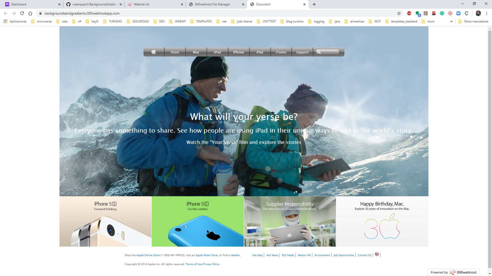

# Building with Backgrounds and Gradients Apple Old Site

This project consists of building a webpage using images as a background and adding gradients to elements. The goal is to make a clone of an old version of the Apple website webpage.

You can find the original project specification at: https://www.theodinproject.com/courses/html5-and-css3/lessons/building-with-backgrounds-and-gradients

## Built With

- HTML
- CSS
- Gradients and Backgrounds 

## Live Demo

https://backgroundsandgradients.000webhostapp.com/

## Authors

👤 **Ruben Paz Chuspe**

- Github: [@rubenpazch](https://github.com/rubenpazch)
- Linkedin: [rubenpch](https://www.linkedin.com/in/rubenpch/)

## 🤝 Contributing

Contributions, issues and feature requests are welcome!

Feel free to check the [issues page](issues/).

## Show your support

Give a ⭐️ if you like this project!

## Acknowledgments

- Hat tip to anyone whose code was used
- Inspiration
- etc

## 📝 License

This project is [MIT](lic.url) licensed.
